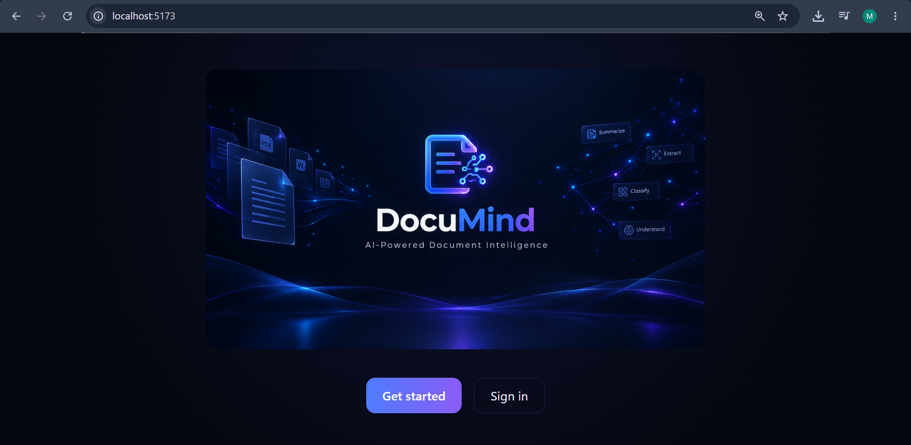
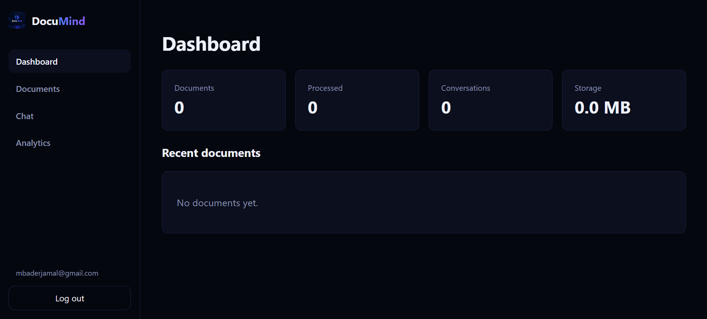
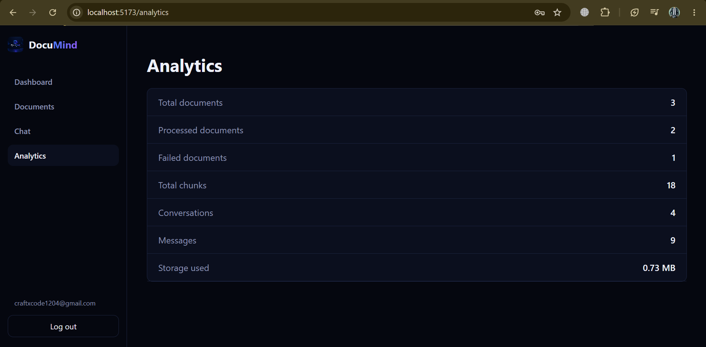
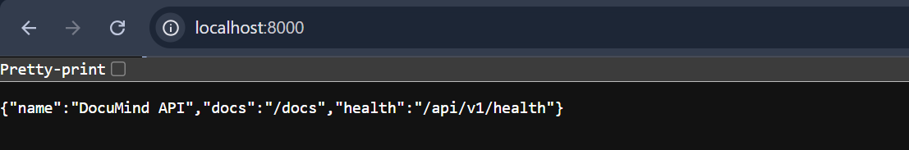

<div align="center">

# 🤖 DOCUMIND AI

### `AI-POWERED DOCUMENT INTELLIGENCE`

**Understand your documents. Ask better questions. Keep your data local.**

<br>


<br>

[](https://www.python.org/)
[](https://fastapi.tiangolo.com/)
[](https://react.dev/)
[](https://ollama.com/)
[](https://www.trychroma.com/)
[](https://www.docker.com/)
[](LICENSE)

<br>

**`[ SYSTEM ONLINE ]` · `[ RAG ENGINE READY ]` · `[ LOCAL AI ACTIVE ]`**

</div>

---

# 🧠 SYSTEM OVERVIEW

> **DocuMind AI is a local-first document intelligence platform built to transform static documents into an intelligent, searchable knowledge system.**

Upload your documents.

Let the system extract, clean, chunk, embed and index them.

Then ask questions in natural language.

DocuMind retrieves the most relevant document context and sends that context to a local LLM through Ollama to generate grounded answers with source information.

### Core principle

```text
┌───────────────────────────────────────────────────────────────┐
│                        DOCUMIND AI                            │
├───────────────────────────────────────────────────────────────┤
│                                                               │
│   YOUR DOCUMENTS                                              │
│        │                                                      │
│        ▼                                                      │
│   ┌─────────────┐                                             │
│   │ VALIDATION  │                                             │
│   └──────┬──────┘                                             │
│          ▼                                                    │
│   ┌─────────────┐                                             │
│   │ EXTRACTION  │                                             │
│   └──────┬──────┘                                             │
│          ▼                                                    │
│   ┌─────────────┐                                             │
│   │  CHUNKING   │                                             │
│   └──────┬──────┘                                             │
│          ▼                                                    │
│   ┌─────────────┐                                             │
│   │ EMBEDDINGS  │                                             │
│   └──────┬──────┘                                             │
│          ▼                                                    │
│   ┌─────────────┐                                             │
│   │  CHROMADB   │                                             │
│   └──────┬──────┘                                             │
│          │                                                    │
│          ▼                                                    │
│   ┌─────────────────────┐                                     │
│   │ RETRIEVAL + OLLAMA  │                                     │
│   └──────────┬──────────┘                                     │
│              ▼                                                │
│      ANSWER + CITATIONS                                       │
│                                                               │
└───────────────────────────────────────────────────────────────┘
```

---

# ⚡ WHAT MAKES DOCUMIND DIFFERENT?

DocuMind is not simply a PDF chatbot.

It combines:

* 🔐 **Local-first AI**
* 🧠 **Retrieval-Augmented Generation**
* 🔎 **Semantic document search**
* 📚 **Citation-aware answers**
* 👤 **Per-user document isolation**
* 🗂️ **Persistent conversations**
* 📊 **Real application analytics**
* ⚙️ **Background document processing**
* 🔌 **Provider abstraction**
* 🚀 **REST API architecture**
* 🐳 **Docker support**
* 🧪 **Automated testing**

The default architecture uses local Sentence Transformers for embeddings, ChromaDB for persistent vector storage and Ollama for local LLM inference.

---

# 🖥️ INTERFACE // SYSTEM VISUALS

## `01 — SPLASH SYSTEM`

<p align="center">

</p>

> **Initializing intelligence layer...**

---

## `02 — AUTHENTICATION // LOGIN`

<p align="center">

</p>

Secure authentication creates isolated user workspaces.

---

## `03 — USER REGISTRATION`

<p align="center">

</p>

Create a private workspace for documents, conversations and analytics.

---

## `04 — COMMAND CENTER // DASHBOARD`

<p align="center">

</p>

### Dashboard intelligence layer

```text
DOCUMENTS        PROCESSED        CONVERSATIONS        STORAGE
    │                │                  │                 │
    └────────────────┴──────────────────┴─────────────────┘
                             │
                             ▼
                    REAL APPLICATION DATA
```

The dashboard exposes document counts, processing status, conversations, storage usage and recent activity.

---

## `05 — AI CHAT // NEURAL INTERFACE`

<p align="center">

</p>

Ask natural-language questions against your indexed documents.

```text
USER
 │
 │  "What are the main conclusions?"
 ▼
┌──────────────────────┐
│ QUESTION EMBEDDING   │
└──────────┬───────────┘
           ▼
┌──────────────────────┐
│ VECTOR RETRIEVAL     │
└──────────┬───────────┘
           ▼
┌──────────────────────┐
│ RELEVANT CHUNKS      │
└──────────┬───────────┘
           ▼
┌──────────────────────┐
│ CONTEXT CONSTRUCTION  │
└──────────┬───────────┘
           ▼
┌──────────────────────┐
│ LOCAL LLM / OLLAMA   │
└──────────┬───────────┘
           ▼
       AI RESPONSE
```

---

## `06 — CHAT MEMORY // HISTORY`

<p align="center">

</p>

Persistent conversation history allows previous document interactions to remain accessible.

---

## `07 — ANALYTICS // TELEMETRY`

<p align="center">

</p>

DocuMind tracks meaningful application metrics including:

* Documents uploaded
* Documents processed
* Pages processed
* Chunks indexed
* Questions asked
* Processing time
* Response latency
* Document usage

No fabricated statistics are intentionally used.

---

# 🔌 API // MACHINE INTERFACE

## REST API

DocuMind exposes its application through a structured `/api/v1` REST API.

```text
/api/v1
│
├── auth
│   ├── POST /register
│   ├── POST /login
│   └── POST /logout
│
├── documents
│   ├── POST   /
│   ├── GET    /
│   ├── GET    /{id}
│   ├── DELETE /{id}
│   └── GET    /{id}/status
│
├── chat
│   └── POST /chat
│
├── conversations
│   ├── GET    /
│   ├── GET    /{id}
│   └── DELETE /{id}
│
├── search
│   └── GET /
│
├── analytics
│   └── GET /
│
└── health
    ├── GET /health
    └── GET /api/v1/health
```

---

# 📡 API DOCUMENTATION

## Swagger

<p align="center">

</p>

## Extended API Documentation

<p align="center">

</p>

## API Interface

<p align="center">

</p>

---

# 🧬 RAG ENGINE

DocuMind implements a classic retrieval-augmented architecture:

```text
                 ┌───────────────────┐
                 │      DOCUMENT     │
                 └─────────┬─────────┘
                           │
                           ▼
                 ┌───────────────────┐
                 │    VALIDATION     │
                 └─────────┬─────────┘
                           │
                           ▼
                 ┌───────────────────┐
                 │  TEXT EXTRACTION  │
                 └─────────┬─────────┘
                           │
                           ▼
                 ┌───────────────────┐
                 │      CLEANING     │
                 └─────────┬─────────┘
                           │
                           ▼
                 ┌───────────────────┐
                 │      CHUNKING     │
                 └─────────┬─────────┘
                           │
                           ▼
                 ┌───────────────────┐
                 │ LOCAL EMBEDDINGS  │
                 └─────────┬─────────┘
                           │
                           ▼
                 ┌───────────────────┐
                 │     CHROMADB      │
                 └─────────┬─────────┘
                           │
                    ┌──────┴──────┐
                    │             │
                    ▼             ▼
               SEARCH QUERY   USER QUESTION
                    │             │
                    └──────┬──────┘
                           ▼
                 ┌───────────────────┐
                 │ VECTOR RETRIEVAL  │
                 └─────────┬─────────┘
                           │
                           ▼
                 ┌───────────────────┐
                 │ CONTEXT BUILDING  │
                 └─────────┬─────────┘
                           │
                           ▼
                 ┌───────────────────┐
                 │      OLLAMA       │
                 │    LOCAL LLM      │
                 └─────────┬─────────┘
                           │
                           ▼
                 ┌───────────────────┐
                 │ ANSWER + SOURCES  │
                 └───────────────────┘
```

This ingestion and question-answering flow is reflected in the repository's documented architecture.

---

# 🧠 AI PROVIDER ARCHITECTURE

DocuMind deliberately avoids hard-coding the entire system around one AI provider.

```text
                 DOCUMIND CORE
                      │
          ┌───────────┼───────────┐
          │           │           │
          ▼           ▼           ▼
       LLM        EMBEDDING    VECTOR STORE
     PROVIDER      PROVIDER      PROVIDER
          │           │           │
          ▼           ▼           ▼
       Ollama    Sentence       ChromaDB
                  Transformers
```

This abstraction makes alternative LLM, embedding, vector-store and document-extraction providers easier to add later.

---

# 🔐 SECURITY // PRIVACY

DocuMind follows a **local-first** security model.

### User isolation

```text
USER A                         USER B
  │                              │
  ├── Documents A                ├── Documents B
  ├── Chunks A                   ├── Chunks B
  └── Conversations A            └── Conversations B
```

One authenticated user is prevented from accessing another user's documents through document APIs, search, vector retrieval, chat/RAG, deletion and conversation endpoints.

### Security mechanisms

```text
✓ JWT authentication
✓ Bcrypt password hashing
✓ Ownership checks
✓ UUID-based identifiers
✓ MIME / extension validation
✓ File-size validation
✓ SHA-256 duplicate detection
✓ Safe generated filenames
✓ Path traversal protection
✓ Parameterized SQL queries
✓ Secure CORS configuration
✓ Environment-based secrets
✓ No credentials in logs
✓ No document contents in logs
```

---

# 📄 DOCUMENT SUPPORT

| Format   | Status |
| -------- | :----: |
| PDF      |    ✅   |
| DOCX     |    ✅   |
| TXT      |    ✅   |
| Markdown |    ✅   |

The extraction layer is provider-based so additional formats can be introduced without redesigning the complete system.

---

# ⚙️ PROCESSING PIPELINE

```text
UPLOAD
  │
  ▼
VALIDATE
  │
  ▼
CHECKSUM / DUPLICATE CHECK
  │
  ▼
EXTRACT
  │
  ▼
CLEAN
  │
  ▼
CHUNK
  │
  ▼
EMBED
  │
  ▼
INDEX
  │
  ▼
READY
```

A failed document is isolated from the rest of the API and its processing failure is retained as document status information.

---

# 🧰 TECHNOLOGY MATRIX

| Layer           | Technology            |
| --------------- | --------------------- |
| Backend         | Python 3.12+          |
| API             | FastAPI               |
| ORM             | SQLAlchemy 2          |
| Validation      | Pydantic v2           |
| Authentication  | JWT + bcrypt          |
| Migrations      | Alembic               |
| Embeddings      | Sentence Transformers |
| LLM Runtime     | Ollama                |
| Vector Database | ChromaDB              |
| PDF Extraction  | PyMuPDF               |
| DOCX Extraction | python-docx           |
| Frontend        | React                 |
| Language        | TypeScript            |
| Build Tool      | Vite                  |
| Testing         | Pytest                |
| Linting         | Ruff                  |
| Containers      | Docker                |
| Orchestration   | Docker Compose        |
| CI              | GitHub Actions        |

---

# 🏗️ ARCHITECTURE

```text
                         ┌───────────────┐
                         │     USER      │
                         └───────┬───────┘
                                 │
                                 ▼
                     ┌─────────────────────┐
                     │ React + TypeScript  │
                     └──────────┬──────────┘
                                │
                           REST / JWT
                                │
                                ▼
                     ┌─────────────────────┐
                     │       FastAPI       │
                     └──────────┬──────────┘
                                │
          ┌─────────────────────┼─────────────────────┐
          │                     │                     │
          ▼                     ▼                     ▼
   AUTHENTICATION        DOCUMENT SERVICE       CHAT SERVICE
          │                     │                     │
          │                     ▼                     │
          │              TEXT EXTRACTION             │
          │                     │                     │
          │                     ▼                     │
          │                  CHUNKING                 │
          │                     │                     │
          │                     ▼                     │
          │              EMBEDDING MODEL              │
          │                     │                     │
          │                     ▼                     │
          │                 CHROMADB                  │
          │                     ▲                     │
          │                     │                     │
          └─────────────────────┼─────────────────────┘
                                │
                                ▼
                             OLLAMA
                                │
                                ▼
                           LOCAL LLM
```

---

# 🗂️ PROJECT STRUCTURE

```text
Documind_AI/
│
├── app/
│   ├── api/
│   ├── core/
│   ├── db/
│   ├── models/
│   ├── schemas/
│   ├── repositories/
│   ├── services/
│   ├── providers/
│   │   ├── embeddings/
│   │   ├── llm/
│   │   ├── vector_store/
│   │   └── document_extractors/
│   ├── workers/
│   ├── prompts/
│   └── utils/
│
├── frontend/
│   ├── src/
│   ├── public/
│   └── package.json
│
├── tests/
├── alembic/
│   └── versions/
│
├── docs/
│   ├── API.md
│   ├── TECHNOLOGY_DECISIONS.md
│   └── screenshots/
│
├── sample_data/
│
├── .github/
│   ├── workflows/
│   ├── ISSUE_TEMPLATE/
│   └── pull_request_template.md
│
├── Dockerfile
├── docker-compose.yml
├── pyproject.toml
├── .env.example
├── SECURITY.md
├── CONTRIBUTING.md
├── CHANGELOG.md
└── README.md
```

---

# 🚀 QUICK START

## 1. Clone

```bash
git clone https://github.com/MUdevelops/Documind_AI.git
cd Documind_AI
```

## 2. Create Python environment

### Windows

```bash
python -m venv .venv
.venv\Scripts\activate
```

### Linux / macOS

```bash
python3 -m venv .venv
source .venv/bin/activate
```

## 3. Install backend

```bash
pip install -e ".[dev]"
```

## 4. Configure environment

### Windows

```bash
copy .env.example .env
```

### Linux / macOS

```bash
cp .env.example .env
```

Never commit your `.env` file.

---

# 🤖 ACTIVATE LOCAL AI

Install Ollama, then download the configured model:

```bash
ollama pull llama3.1
```

Start the local model service:

```bash
ollama serve
```

DocuMind uses Sentence Transformers for local embeddings, which are downloaded once and cached locally.

---

# 🗄️ DATABASE

Run migrations:

```bash
alembic upgrade head
```

---

# ▶️ START BACKEND

```bash
uvicorn app.main:app --reload
```

Backend:

```text
http://localhost:8000
```

Swagger:

```text
http://localhost:8000/docs
```

ReDoc:

```text
http://localhost:8000/redoc
```

---

# 🎨 START FRONTEND

Open another terminal:

```bash
cd frontend
npm install
npm run dev
```

Frontend:

```text
http://localhost:5173
```

---

# 🐳 DOCKER MODE

```bash
docker compose up --build
```

Check containers:

```bash
docker compose ps
```

Stop:

```bash
docker compose down
```

If Ollama is configured as a Compose service:

```bash
docker compose exec ollama ollama pull llama3.1
```

---

# 🧪 TESTING

Run the complete test suite:

```bash
pytest
```

Lint:

```bash
ruff check .
```

Formatting:

```bash
ruff format --check .
```

Recommended development check:

```bash
ruff check .
ruff format --check .
pytest
```

The repository includes unit, API and security-oriented tests, including cross-user document isolation checks.

---

# 🩺 HEALTH MONITORING

DocuMind exposes health information across the major system dependencies:

```text
                 APPLICATION
                      │
          ┌───────────┼───────────┐
          ▼           ▼           ▼
      DATABASE    VECTOR STORE    LLM
```

This allows local troubleshooting without exposing sensitive configuration.

---

# 🛠️ CLI

Health:

```bash
python -m app.cli health
```

Reindex documents:

```bash
python -m app.cli reindex
```

Create an administrator:

```bash
python -m app.cli create-admin \
  --email admin@example.com \
  --password changeme123
```

> ⚠️ Demo credentials should only be used during local development.

---

# ⚠️ CURRENT LIMITATIONS

DocuMind is ambitious, but it is not magic.

Current limitations include:

* Scanned/image-only PDFs do not currently have OCR enabled.
* Chunking is currently character-based rather than fully token-aware.
* Background processing is designed primarily for local/single-node operation.
* Local LLM performance depends heavily on available CPU, GPU and RAM.
* Larger models can require significant system resources.
* Streaming behavior depends on the selected LLM provider implementation.

---

# 🛣️ ROADMAP // NEXT EVOLUTION

```text
CURRENT
  │
  ├── Local RAG
  ├── Semantic Search
  ├── Citation-aware Q&A
  ├── Local LLM
  ├── Analytics
  └── Secure User Isolation
          │
          ▼
NEXT
  │
  ├── OCR
  ├── Token-aware chunking
  ├── Hybrid retrieval
  ├── Reranking
  ├── Streaming responses
  ├── Multi-document reasoning
  ├── Advanced previews
  ├── More LLM providers
  ├── Distributed workers
  ├── Production observability
  └── Kubernetes / S3 deployment
```

The repository already identifies these areas as future improvements.

---

# 🧪 ENGINEERING PHILOSOPHY

```text
┌─────────────────────────────────────────────────────┐
│                 DOCUMIND PRINCIPLES                 │
├─────────────────────────────────────────────────────┤
│                                                     │
│   PRIVACY       → Keep data local                   │
│   MODULARITY    → Abstract AI providers             │
│   SECURITY      → Isolate every user's data         │
│   TRACEABILITY  → Ground answers in retrieved data  │
│   TESTABILITY   → Verify critical system behavior   │
│   EXTENSIBILITY → Build for future providers        │
│                                                     │
└─────────────────────────────────────────────────────┘
```

---

# 🧠 AI VIBING // DEVELOPMENT MODE

```text
> INITIALIZING DOCUMIND CORE...

[██████████████████████████████] 100%

> LOADING DOCUMENT ENGINE .......... OK
> LOADING EMBEDDING ENGINE ......... OK
> CONNECTING VECTOR MEMORY ......... OK
> CONNECTING LOCAL LLM ............. OK
> VERIFYING USER ISOLATION ......... OK
> VERIFYING API .................... OK
> VERIFYING FRONTEND ............... OK
> RUNNING TEST MATRIX .............. OK

╔══════════════════════════════════════════════╗
║             ARTIFICIAL INTELLIGENCE         ║
║                  ONLINE                      ║
║                                              ║
║        DOCUMENTS → KNOWLEDGE → ANSWERS       ║
║                                              ║
║              SYSTEM READY                    ║
╚══════════════════════════════════════════════╝
```

### `THE AI DOESN'T NEED YOUR DOCUMENTS TO LEAVE YOUR MACHINE.`

**Local intelligence. Private knowledge. Grounded answers.**

---

# 📸 COMPLETE SCREENSHOT INDEX

| Module              | Screenshot                            |
| ------------------- | ------------------------------------- |
| Splash              | `Screenshots/Splash.png`              |
| Login               | `Screenshots/Login Account.png`       |
| Registration        | `Screenshots/Register Account.png`    |
| Dashboard           | `Screenshots/Dashboard.png`           |
| AI Chat             | `Screenshots/AI Powered Chats.png`    |
| Chat History        | `Screenshots/Chat History.png`        |
| Analytics           | `Screenshots/Analytics.png`           |
| API                 | `Screenshots/API.png`                 |
| API Documentation   | `Screenshots/API Documentation.png`   |
| API Documentation 2 | `Screenshots/API Documentation 2.png` |

---

# 🔒 SECURITY

If you discover a security vulnerability, please follow the responsible disclosure process described in [`SECURITY.md`](SECURITY.md) rather than immediately opening a public issue.

---

# 🤝 CONTRIBUTING

Contributions are welcome.

Before submitting a pull request:

```bash
ruff check .
ruff format --check .
pytest
```

Please review [`CONTRIBUTING.md`](CONTRIBUTING.md) before contributing.

---

# 📜 LICENSE

DocuMind AI is released under the **MIT License**.

See [`LICENSE`](LICENSE) for the complete license text.

---

# 👨‍💻 BUILT BY MUDEVELOPS

<div align="center">

### `MUdevelops`

**AI • Full-Stack • Backend • Automation**

<br>

<a href="https://github.com/MUdevelops">

</a>

<br><br>

> **Build systems. Build intelligence. Build locally.**

<br>


</div>
