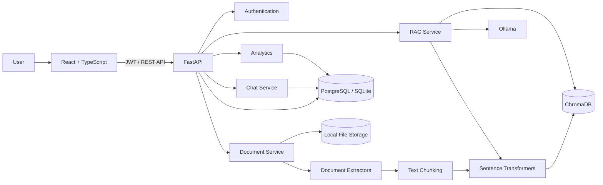

<div align="center">

# 🧠 DocuMind

### AI-Powered Document Intelligence Platform


<br>


</div>

**DocuMind** is a local-first AI document intelligence platform that lets you upload your own **PDF, DOCX, TXT, and Markdown documents**, search them semantically, and ask questions using **Retrieval-Augmented Generation (RAG)**.

Built with privacy and zero-cost local AI in mind, DocuMind uses **local embeddings, a local vector database, and Ollama-powered LLMs** instead of requiring paid AI APIs.

<div align="center">

> **Your documents. Your infrastructure. Your AI.** 🔐


</div>

---

<div align="center">


</div>

## ✨ Highlights

- 🔐 Secure authentication with JWT access/refresh tokens
- 📄 PDF, DOCX, TXT & Markdown support
- ⚙️ Background document processing pipeline
- 🧠 Local semantic embeddings with Sentence Transformers
- 🔎 Semantic document search
- 💬 AI-powered document Q&A
- 📚 Citation-aware RAG responses
- 🗂️ Persistent conversation history
- 📊 Real-time document and usage analytics
- 👤 Strict per-user document isolation
- 🗑️ Secure document deletion
- 🐳 Docker & Docker Compose support
- 🧪 Automated testing with Pytest
- 🚀 REST API powered by FastAPI
- 🎨 Modern responsive React interface
- 💰 No paid API required

---

# 📸 Screenshots

## Splash Screen

---

## Login

Secure authentication with validation and clear error handling.

---

## Registration

Users can create their own private DocuMind workspace.

---

## Dashboard

The dashboard provides an overview of:

- Total documents
- Processed documents
- Conversations
- Storage usage
- Recent documents
- Recent conversations

All displayed statistics are derived from real application data.

---

## Document Management

Upload, search, filter, inspect processing status, and delete your documents from a single workspace.

Supported formats:

`PDF` · `DOCX` · `TXT` · `Markdown`

---

## Document Upload

Documents pass through a validation and processing pipeline before becoming available for AI queries.

---

## AI Chat

Ask natural-language questions about your documents and receive answers generated from retrieved document context.

---

## Citations & Sources

Responses include source information from the retrieved document chunks, including available:

- Filename
- Page number
- Chunk number
- Relevance score

DocuMind does not intentionally generate citations that are disconnected from retrieved sources.

---

## Analytics

Track meaningful usage metrics such as:

- Documents uploaded
- Documents processed
- Pages processed
- Chunks indexed
- Questions asked
- Processing time
- Response latency
- Document usage

No fabricated statistics are used.

---

<div align="center">

</div>

# 🏗️ Architecture



---

# 🔄 RAG Pipeline

DocuMind follows a Retrieval-Augmented Generation architecture:

```text
                 DOCUMENT INGESTION

PDF / DOCX / TXT / Markdown
             │
             ▼
         Validation
             │
             ▼
       Text Extraction
             │
             ▼
       Text Cleaning
             │
             ▼
          Chunking
             │
             ▼
     Local Embeddings
             │
             ▼
         ChromaDB
             │
             ▼
           READY


                  QUESTION ANSWERING

       User Question
             │
             ▼
     Question Embedding
             │
             ▼
      Vector Retrieval
             │
             ▼
       Relevant Chunks
             │
             ▼
      Context Construction
             │
             ▼
          Ollama
             │
             ▼
      Answer + Citations

```

---

# 🧰 Technology Stack

## Backend

| TechnologyPurpose |                      |
| ----------------- | -------------------- |
| Python 3.12+      | Core backend         |
| FastAPI           | REST API             |
| SQLAlchemy 2      | ORM                  |
| Pydantic v2       | Validation & schemas |
| Alembic           | Database migrations  |
| PyJWT             | Authentication       |
| bcrypt            | Password hashing     |

## AI / RAG

| TechnologyPurpose     |                           |
| --------------------- | ------------------------- |
| Sentence Transformers | Local embeddings          |
| Ollama                | Local LLM runtime         |
| ChromaDB              | Persistent vector storage |
| PyMuPDF               | PDF extraction            |
| python-docx           | DOCX extraction           |

## Frontend

| TechnologyPurpose |                           |
| ----------------- | ------------------------- |
| React             | UI                        |
| TypeScript        | Type-safe frontend        |
| Vite              | Development/build tooling |

## Engineering

| TechnologyPurpose |                      |
| ----------------- | -------------------- |
| Pytest            | Automated testing    |
| Ruff              | Linting & formatting |
| Docker            | Containerization     |
| Docker Compose    | Local orchestration  |
| GitHub Actions    | CI                   |

---

# 🔐 Privacy & Security

DocuMind is designed around local-first document processing.

### User isolation

Every document, chunk, conversation, and search operation is scoped to the authenticated user.

This prevents:

```text
User A
   │
   ├── Documents A
   ├── Chunks A
   └── Conversations A

User B
   │
   ├── Documents B
   ├── Chunks B
   └── Conversations B

```

User A cannot retrieve User B's documents through:

- Document APIs
- Search
- Vector retrieval
- Chat/RAG
- Delete operations
- Conversation endpoints

### Additional protections

- Bcrypt password hashing
- JWT authentication
- Ownership checks
- UUID-based public identifiers
- File size validation
- MIME/extension validation
- SHA-256 checksum detection
- Safe generated storage filenames
- Path traversal protection
- SQLAlchemy parameterized queries
- Secure CORS configuration
- Environment-based secrets
- No credentials in logs
- No document contents in logs
- Production-safe error responses

---

# 📄 Supported Documents

| FormatSupport |   |
| ------------- | - |
| PDF           | ✅ |
| DOCX          | ✅ |
| TXT           | ✅ |
| Markdown      | ✅ |

The extraction layer is provider-based, making additional formats easier to add later.

---

# ⚡ Document Processing

Every upload follows:

```text
UPLOAD
   ↓
VALIDATE
   ↓
CHECKSUM / DUPLICATE CHECK
   ↓
EXTRACT
   ↓
CLEAN
   ↓
CHUNK
   ↓
EMBED
   ↓
INDEX
   ↓
READY

```

A failed document does not crash the entire API.

Processing errors are stored against the document and exposed through its processing status.

---

# 💬 AI Provider Architecture

DocuMind does not tightly couple the application to a single AI provider.

The architecture provides abstractions for:

```text
LLMProvider
EmbeddingProvider
VectorStore
DocumentExtractor

```

The default configuration uses:

```text
EmbeddingProvider
       ↓
Sentence Transformers
       ↓
Local Model

```

and:

```text
LLMProvider
       ↓
Ollama
       ↓
Local LLM

```

This makes it possible to add alternative providers later without rewriting the RAG system.

---

# 💰 Zero-Cost Local AI

The default setup does **not** require:

- OpenAI API
- Anthropic API
- Google Gemini API
- Pinecone
- AWS
- Azure
- Paid databases
- Paid vector databases

AI inference can run entirely on your own machine.

---

# 🚀 Quick Start

## Requirements

Install:

- Python 3.12+
- Node.js 18+
- Ollama
- Git

Docker is optional.

---

## 1. Clone

```bash
git clone https://github.com/MUdevelops/Documind_AI.git
cd Documind_AI

```

---

## 2. Backend Setup

### Linux / macOS

```bash
python3 -m venv .venv
source .venv/bin/activate

```

### Windows

```powershell
python -m venv .venv
.venv\Scripts\activate

```

Install dependencies:

```bash
pip install -e ".[dev]"

```

---

## 3. Environment Configuration

```bash
cp .env.example .env

```

On Windows:

```powershell
copy .env.example .env

```

Review the configuration before starting the application.

---

# 🤖 Local AI Setup

Install Ollama from the official website:

[Ollama](https://ollama.com/?utm_source=chatgpt.com)

Then download a supported local model:

```bash
ollama pull llama3.1

```

Start Ollama if it is not already running:

```bash
ollama serve

```

DocuMind uses Sentence Transformers for local embeddings.

The configured embedding model is downloaded once and cached locally.

After the initial model download, embedding generation can operate offline.

---

# 🗄️ Database Setup

Run the Alembic migrations:

```bash
alembic upgrade head

```

The application should always use migrations rather than manually creating database tables.

---

# ▶️ Start Backend

```bash
uvicorn app.main:app --reload

```

Backend:

```text
http://localhost:8000

```

Swagger:

```text
http://localhost:8000/docs

```

ReDoc:

```text
http://localhost:8000/redoc

```

---

# 🎨 Start Frontend

Open another terminal:

```bash
cd frontend
npm install
npm run dev

```

Frontend:

```text
http://localhost:5173

```

---

# 🐳 Docker

The project also provides Docker support.

Build and start:

```bash
docker compose up --build

```

If Ollama is included as a Compose service:

```bash
docker compose exec ollama ollama pull llama3.1

```

Check running containers:

```bash
docker compose ps

```

Stop:

```bash
docker compose down

```

---

# 🧪 Testing

Run the complete test suite:

```bash
pytest

```

Lint:

```bash
ruff check .

```

Formatting check:

```bash
ruff format --check .

```

A useful development workflow is:

```bash
ruff check .
ruff format --check .
pytest

```

---

# 📊 API

The REST API is organized under:

```text
/api/v1

```

### Authentication

```text
POST /api/v1/auth/register
POST /api/v1/auth/login
POST /api/v1/auth/logout

```

### Documents

```text
POST   /api/v1/documents
GET    /api/v1/documents
GET    /api/v1/documents/{id}
DELETE /api/v1/documents/{id}
GET    /api/v1/documents/{id}/status

```

### Chat

```text
POST   /api/v1/chat
GET    /api/v1/conversations
GET    /api/v1/conversations/{id}
DELETE /api/v1/conversations/{id}

```

### Search

```text
GET /api/v1/search

```

### Analytics

```text
GET /api/v1/analytics

```

### Health

```text
GET /health
GET /api/v1/health

```

Interactive API documentation:

```text
http://localhost:8000/docs

```

Human-readable API documentation is available in:

```text
docs/API.md

```

---

# 🛠️ CLI

Useful development/administration commands include:

```bash
python -m app.cli health

```

Reindex documents:

```bash
python -m app.cli reindex

```

Create an administrator:

```bash
python -m app.cli create-admin \
  --email admin@example.com \
  --password changeme123

```

Use demo credentials only for local development and change them immediately.

---

# ⚙️ Environment Variables

Example configuration:

```env
DATABASE_URL=
SECRET_KEY=

VECTOR_DB_PATH=

LLM_PROVIDER=
LLM_MODEL=

EMBEDDING_MODEL=

MAX_UPLOAD_SIZE=

CORS_ORIGINS=

CHUNK_SIZE=
CHUNK_OVERLAP=

TOP_K=
SIMILARITY_THRESHOLD=

```

See:

```text
.env.example

```

for the complete configuration.

Never commit `.env`.

---

# 📁 Project Structure

```text
Documind_AI/
│
├── app/
│   ├── api/
│   ├── core/
│   ├── db/
│   ├── models/
│   ├── schemas/
│   ├── repositories/
│   ├── services/
│   ├── providers/
│   │   ├── embeddings/
│   │   ├── llm/
│   │   ├── vector_store/
│   │   └── document_extractors/
│   ├── workers/
│   ├── prompts/
│   └── utils/
│
├── frontend/
│   ├── src/
│   ├── public/
│   └── package.json
│
├── tests/
│
├── alembic/
│   └── versions/
│
├── docs/
│   ├── API.md
│   ├── TECHNOLOGY_DECISIONS.md
│   └── screenshots/
│
├── sample_data/
│
├── .github/
│   ├── workflows/
│   ├── ISSUE_TEMPLATE/
│   └── pull_request_template.md
│
├── .env.example
├── .gitignore
├── .dockerignore
├── Dockerfile
├── docker-compose.yml
├── pyproject.toml
├── LICENSE
├── README.md
├── SECURITY.md
├── CONTRIBUTING.md
├── CODE_OF_CONDUCT.md
└── CHANGELOG.md

```

---

# 🧪 Testing Strategy

DocuMind includes tests across multiple layers.

### Unit Tests

- Document extraction
- Text cleaning
- Chunking
- Embedding
- Retrieval
- Authentication utilities
- Validation

### API Tests

- Registration
- Login
- Protected routes
- Document upload
- Document listing
- Document deletion
- Chat
- Search
- Analytics

### Security Tests

Most importantly:

```text
User A
  ↓
Cannot access
  ↓
User B's documents

```

Tests verify that cross-user document access is blocked.

---

# 🩺 Health Monitoring

Health endpoints distinguish between major dependencies:

```text
Application
     │
     ├── Database
     ├── Vector Store
     └── LLM

```

This makes local troubleshooting easier without exposing sensitive configuration.

---

# 🔧 Troubleshooting

### Embedding model unavailable

The first embedding request may require internet access to download the configured Sentence Transformers model.

After the model is cached locally, it can operate without repeatedly downloading the model.

---

### Ollama unavailable

Check:

```bash
ollama serve

```

Then verify the model:

```bash
ollama list

```

If necessary:

```bash
ollama pull llama3.1

```

---

### Database migration errors

Run:

```bash
alembic upgrade head

```

Check the current migration:

```bash
alembic current

```

---

### SQLite locking

For heavier concurrent workloads, configure PostgreSQL through `DATABASE_URL`.

SQLite is convenient for local development but is not ideal for high-concurrency production deployments.

---

# ⚠️ Current Limitations

- Scanned/image-only PDFs require OCR support that is not currently enabled.
- Chunking is character-based rather than fully token-aware.
- Background processing is designed for single-node/local deployments.
- Local LLM performance depends heavily on available CPU/GPU/RAM.
- Large models may require significant system resources.
- Streaming responses may depend on the selected LLM provider implementation.

---

# 🛣️ Future Improvements

Potential improvements include:

- OCR pipeline for scanned documents
- Token-aware chunking
- Hybrid keyword + vector retrieval
- Reranking models
- Streaming LLM responses
- Celery/RQ distributed workers
- Advanced document previews
- Multi-document reasoning
- More embedding providers
- More local LLM providers
- Kubernetes deployment
- Production observability
- S3-compatible object storage
- Role-based access control

---

# 🤝 Contributing

Contributions are welcome.

Before submitting a pull request:

```bash
ruff check .
ruff format --check .
pytest

```

Please read:

```text
CONTRIBUTING.md

```

for contribution guidelines.

---

# 🔒 Security

If you discover a security vulnerability, please do not immediately open a public issue.

Review:

```text
SECURITY.md

```

for the responsible disclosure process.

---

# 📜 License

DocuMind is released under the **MIT License**.

See:

```text
LICENSE

```

for the complete license text.

---

# 👨‍💻 Author

**MUdevelops**

GitHub:

[MUdevelops](https://github.com/MUdevelops?utm_source=chatgpt.com)

---

# ⭐ Why DocuMind?

DocuMind demonstrates a practical production-oriented implementation of:

- Python backend engineering
- FastAPI
- REST API design
- Authentication & authorization
- SQLAlchemy
- Database migrations
- Document processing
- Vector databases
- Embedding models
- Retrieval-Augmented Generation
- Local LLM inference
- React + TypeScript
- Docker
- Automated testing
- CI/CD
- Security engineering
- AI provider abstraction
- Full-stack application architecture

It is designed to be **understandable, extensible, and runnable locally without paid AI services**.

---

<div align="center">

### 🧠 DocuMind

**Understand your documents. Ask better questions. Keep your data local.**


</div>

⭐ Star the repository if you find it useful.
