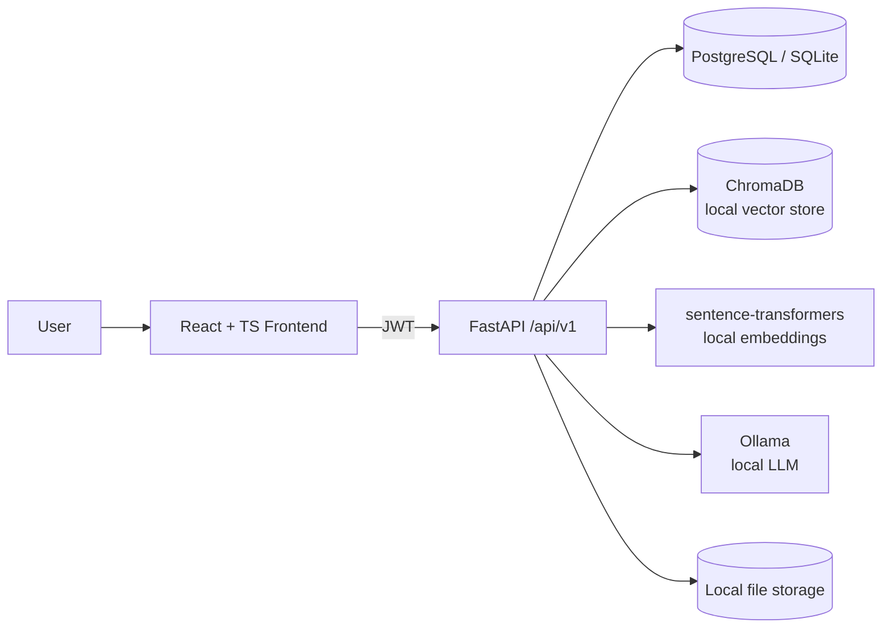

# DocuMind — AI-Powered Document Intelligence Platform

Local-first Retrieval-Augmented Generation over your own PDF/DOCX/TXT/Markdown
documents. No paid APIs required: embeddings run locally via
sentence-transformers, the LLM runs locally via [Ollama](https://ollama.com),
and vectors are stored locally in ChromaDB.

## Features

- Register / login / logout (JWT access + refresh tokens, bcrypt hashing)
- Upload PDF, DOCX, TXT, Markdown with validation (size, MIME/extension, checksum dedupe)
- Background pipeline: extract → clean → chunk → embed → vector index → ready
- Ask questions and get RAG answers with real citations (filename, page, chunk, score)
- Chat history saved as conversations/messages
- Semantic document search
- Per-user document management (list/filter/delete, processing status)
- Real analytics derived from the database (no mock numbers)
- Strict per-user data isolation across every document/search/chat endpoint

## Architecture



## Tech stack

- **Backend**: Python 3.12, FastAPI, SQLAlchemy 2, Alembic, Pydantic v2, PyJWT, Passlib/bcrypt
- **Documents**: PyMuPDF (PDF), python-docx (DOCX), native TXT/Markdown
- **AI**: sentence-transformers (embeddings), Ollama (LLM), ChromaDB (vector store)
- **Frontend**: React + TypeScript + Vite
- **Infra**: Docker, Docker Compose, GitHub Actions, pytest, Ruff

## Requirements

- Python 3.12+
- Node.js 18+ (for the frontend)
- [Ollama](https://ollama.com) installed locally (or run via Docker Compose)
- Docker + Docker Compose (optional, for containerized run)

## Installation (local, no Docker)

```bash
# Backend
python -m venv .venv
source .venv/bin/activate  # Windows: .venv\Scripts\activate
pip install -e ".[dev]"
cp .env.example .env

# Frontend
cd frontend
npm install
cd ..
```

## Local AI setup

```bash
curl -fsSL https://ollama.com/install.sh | sh   # or see ollama.com for your OS
ollama pull llama3.1
ollama serve   # usually starts automatically
```

The first request that needs embeddings will download the
`sentence-transformers/all-MiniLM-L6-v2` model automatically (~90MB) and
cache it locally — no API key needed.

## Running

```bash
# Apply database migrations
alembic upgrade head

# Start the API
uvicorn app.main:app --reload

# In another terminal, start the frontend
cd frontend && npm run dev
```

API: http://localhost:8000 · Docs: http://localhost:8000/docs · Frontend: http://localhost:5173

## Testing

```bash
pytest
ruff check .
ruff format --check .
```

## Docker

```bash
docker compose up --build
docker compose exec ollama ollama pull llama3.1
```

Backend: http://localhost:8000 · Frontend: http://localhost:5173

## CLI

```bash
python -m app.cli health
python -m app.cli reindex
python -m app.cli create-admin --email admin@example.com --password changeme123
```

## API docs

Interactive OpenAPI docs are served at `/docs` when the backend is running.
See also [`docs/API.md`](docs/API.md).

## Project structure

```text
app/            FastAPI backend (api, core, db, models, schemas, services, providers)
frontend/       React + TypeScript + Vite SPA
tests/          Pytest suite
alembic/        Database migrations
docs/           Additional documentation
sample_data/    Safe synthetic sample documents
```

## Security

- Bcrypt password hashing, JWT access/refresh tokens
- Every document/chunk/conversation query is scoped to `owner_id` — users
  cannot read, search, or delete each other's data through any endpoint
- Safe, randomly generated on-disk filenames (no path traversal via user input)
- Extension + size validation on upload, SHA-256 checksum de-duplication
- Structured logging with request IDs; credentials/tokens/document contents are never logged
- No secrets committed; see `.env.example`

## Troubleshooting

- **"Embedding model unavailable"**: first run needs internet access to
  download the sentence-transformers model once; afterward it's fully offline.
- **"LLM is not currently available"**: make sure `ollama serve` is running
  and `ollama pull llama3.1` has completed.
- **SQLite locked errors**: switch `DATABASE_URL` to Postgres for concurrent
  background processing under load.

## Limitations

- Scanned/image-only PDFs are not OCR'd (text-layer extraction only)
- Chunking is character-based, not token-aware
- Single-node background processing (no distributed task queue)
- This repository was generated in an environment without outbound network
  access, so dependency installation, test execution, and Docker builds were
  **not executed** by the generator — see `docs/TECHNOLOGY_DECISIONS.md` for
  what was and wasn't validated before you run it yourself.

## Future improvements

- OCR fallback for scanned documents
- Token-aware chunking, hybrid keyword+vector search
- Celery/RQ-based background workers, streaming chat responses

## Contributing

See [CONTRIBUTING.md](CONTRIBUTING.md).

## License

MIT — see [LICENSE](LICENSE).
